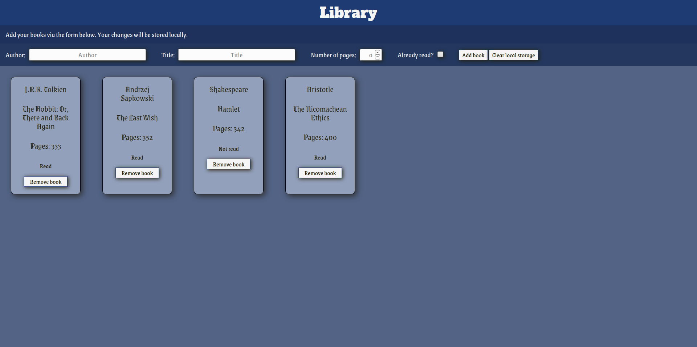

# Library

This project for the JavaScript curriculum at [The Odin Project](https://www.theodinproject.com) is a "library" where the user can view, add and remove books as well as change their status. The goal was to learn working with objects and organizing one's code. The application is frontend only and the books are saved via localStorage as an array of objects.

## Demo

[View it here](https://reinimax.github.io/library/)
